## [Introduction](#table-of-content)

This is Part of my Fourth Project at Code Institute.

This is a simple Restaurant Booking System, were I can book tables based on a date and time
I am also able to see the Restaurant's Menu and Chef's specials.

---

# Table of Content

- [Planning](#planning)
  - [Wireframes](#wireframes)
  - [Ux-design](#ux-design)
  - [Colour Pallet](#colour-pallet)
  - [User Stories using MOSCOW Prioritization techniques](#user-stories-using-moscow-prioritization-techniques)
  - [How to start this project locally](#how-to-start-this-project-locally)
  - [How this project was deployed to Heroku](#how-this-project-was-deployed-to-heroku)
  - [Technology Used](#technology-used)
- [Features](#features)
  - [Features that have been included in this project](#features-that-have-been-included-in-this-project)
  - [Future features to be added at a later stage](#future-features-to-be-added-at-a-later-stage)
- [Testing](#testing)
  - [Manual Testing](#manual-testing)
  - [Automated Testing](#automated-testing)
- [Bugs](#bugs)
  - [The text is not aligned correctly to the Authentication Icon](#the-text-is-not-aligned-correctly-to-the-authentication-icon)
  - [Labels are not correctly sitting next to the Icons](#labels-are-not-correctly-sitting-next-to-the-icons)
  - [Problem with Hamburger Menu](#problem-with-hamburger-menu)
  - [Hamburger menu jumps as I try and open and close menu](#hamburger-menu-jumps-as-i-try-and-open-and-close-menu)
  - [Operational error in database as trying to run auto test](#operational-error-in-database-as-trying-to-run-auto-test)
- [Credits](#credits)

---

## [Planning](#table-of-content)

These Wireframes and UX Designs were designed on Figma

### [Wireframes](#planning)

#### Homepage

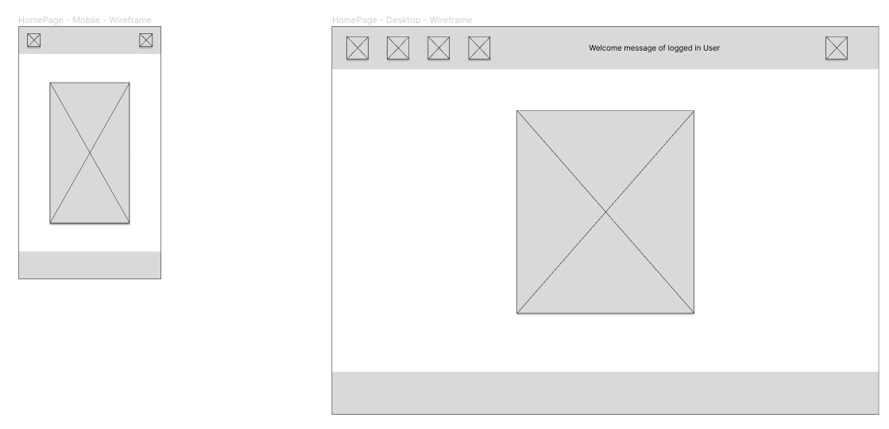

#### Menu Page

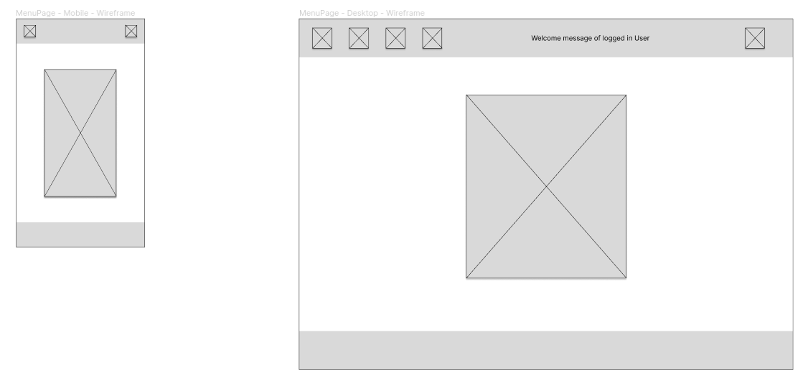

#### About Page

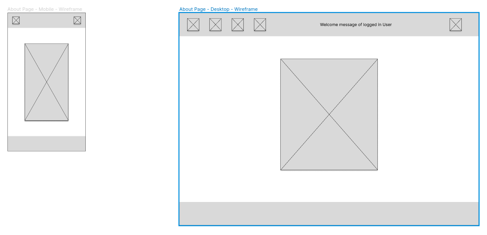

#### Book a table Page

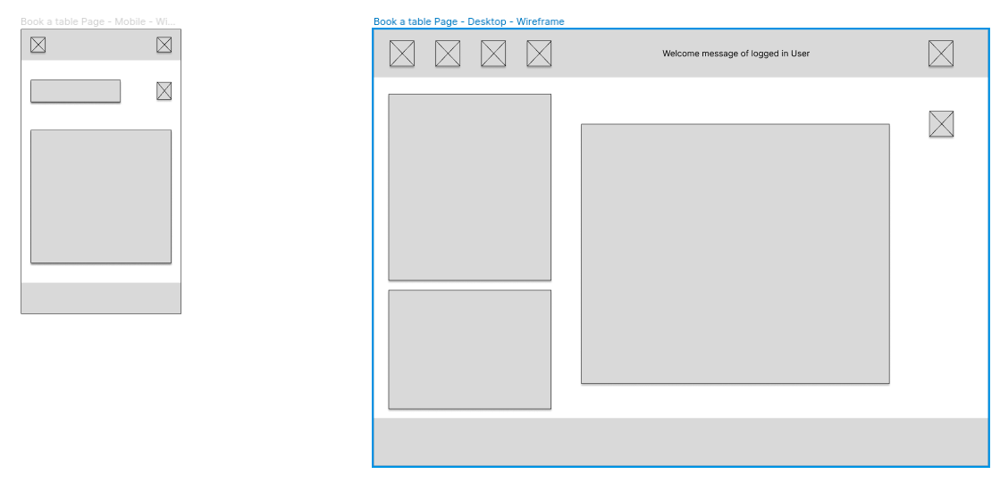

### [Ux-design](#planning)

#### Home Page

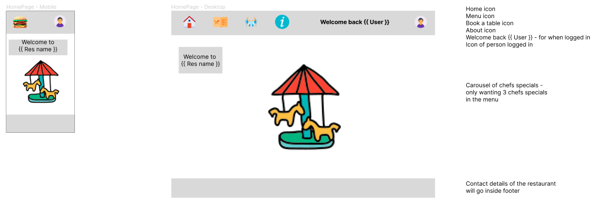

#### Menu Page

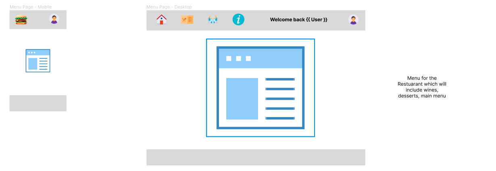

#### Book Table Page

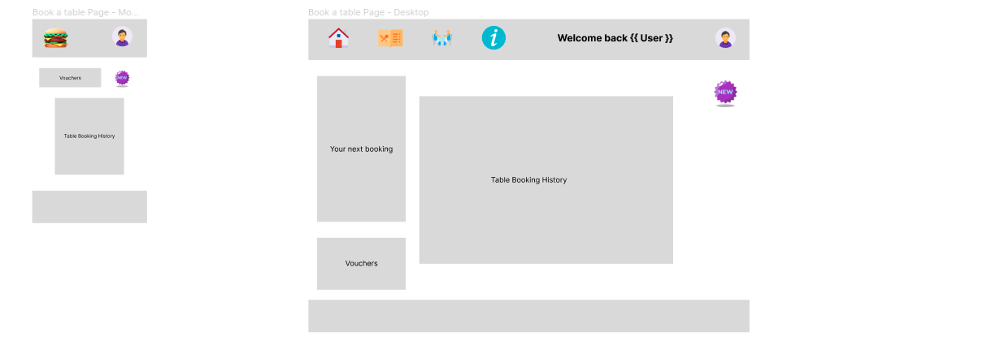

#### About Page

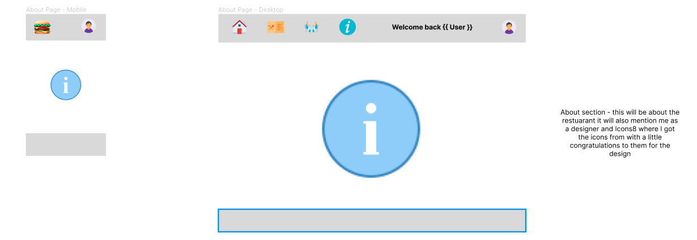

### ERD diagram

### [Colour Pallet](#planning)

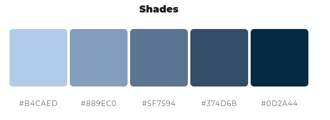

Click [here](https://coolors.co/9f7e69-d2bba0-f2efc7-f7ffe0-ffeee2) to see where I got this color pallet from

How I came by this color Pallet:

I went onto Google and googled: What would be a nice color theme for an exclusive restaurant

- See
  results [here](https://www.google.com/search?client=firefox-b-d&q=what+would+be+a+nice+color+theme+for+an+exclusive+restaurant&dlnr=1&sei=bazIZcmsAvKxhbIP18mBkAE)
- I had thought that a nice light gray would've worked well as some of the colors used with my UX design was already a
  grayish color

### [User Stories using MOSCOW Prioritization techniques](#planning)

This Project was done in incremental stages, trying my best to follow the agile methods.

Header

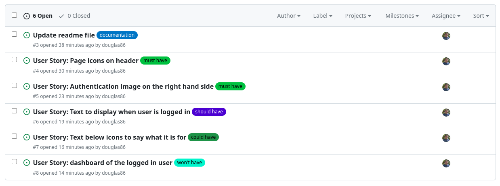

Kambam board

Explanation of the columns on the board:

- Backlog: this is where the issues start from when they are created
- Ready: these issues are ready to be picked up so work can be conducted
- In Progress: This is what is busy being worked on
- In review: This is the stage were the testing gets done
- Done: for all completed issues

Milestones

This project was done in incremental stages, building it page by page.
As such, the milestone percentage will change slightly in each iteration.

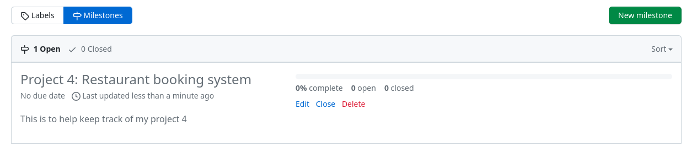

This is when I am 46% done, but only the header issue was added

Footer

- The footer had only three issues in it, so I only labeled them as Must-have
- There was also an issue that I created for Documentation

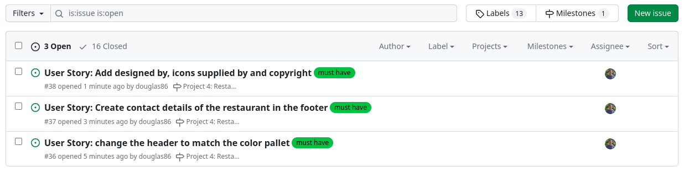

- Once the footer had been completed, 84% was done.

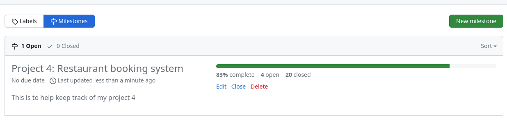

Homepage

- There were only four issues added for this section
- As I didn't plan on doing a lot of work here

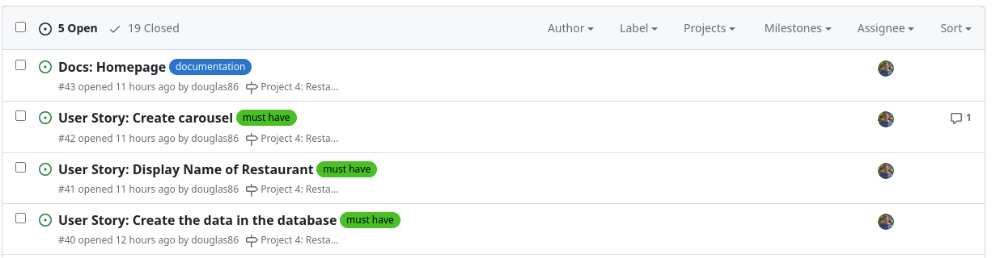

- The milestone was taken after the homepage was done
- When the Menu Page and About Page were added as issues

Menu Page

- I created 10 sticky notes to decide on what I wanted for the issues
- Once I knew what I wanted, then created the issues for the Kambam board,
- Sorting them out into Moscow priorities sticking with 60% Must-have
- I have also created an issue for the documentation
- Which I will do after all required issues are done

Sticky notes on Figma to plan what sort of issues I am wanting to solve

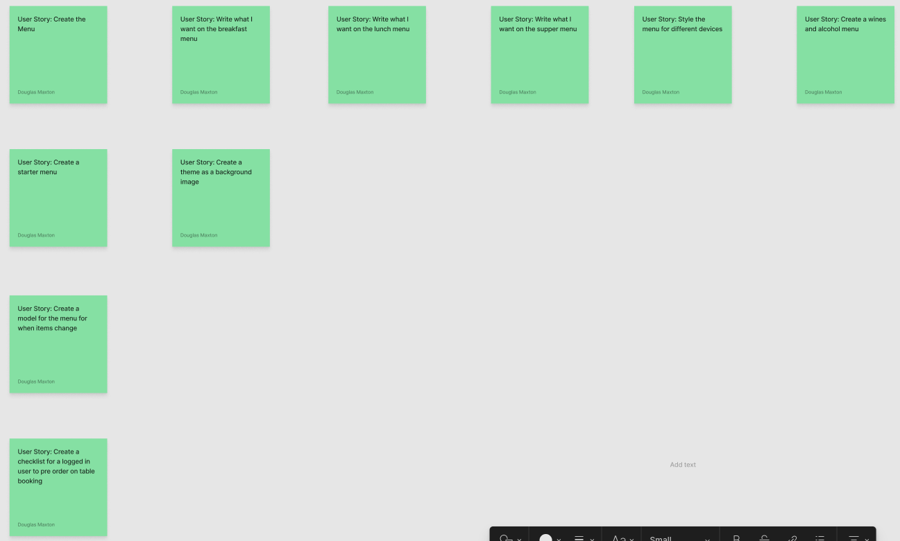

Once the Issues were created, I gave them their labels using MOSCOW priorities

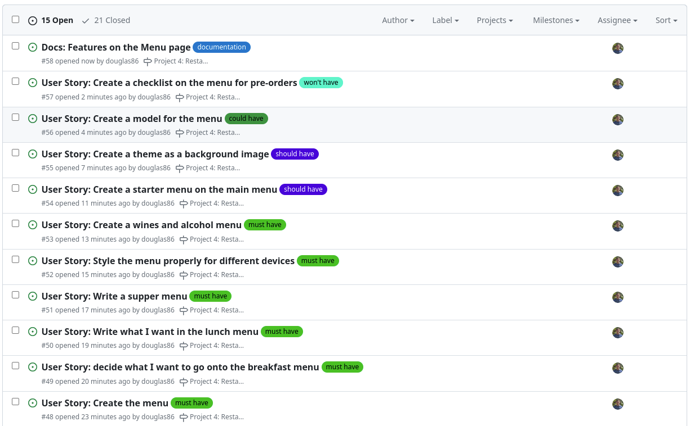

After all, planning is in place the milestone section shows percentage done

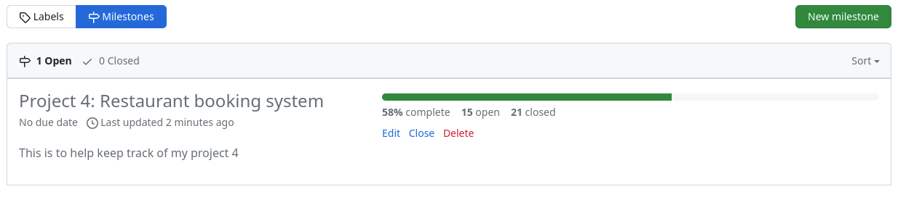

### [How to start this project locally](#planning)

- when using ssh
- git clone git@github.com:douglas86/ci-project4-restaurant-booking-system.git
- when using http
- git clone https://github.com/douglas86/ci-project4-restaurant-booking-system.git
- make sure to have a look at the runtime.txt file to see what version of python I am using
- then create a virtual environment with that python version
- to see if a virtual environment has been created, the words venv in brackets will appear in the terminal
- as I am using pycharm, the virtual environment will start automatically when I start my IDE
- then install all the packages needed for this project using the following command
- pip install -r requirements.txt
- to start the Django server, run the following command
- create an env.py file this is used to store all environment variables
- create the variable needs for this project see the image below
- placing the name of the variables in the empty quotation marks
- make sure to set DJANGO_DEBUG = True
- django secret keys should never be committed to GitHub
- so if you need one, follow the following link
- [generate a new secret key](https://www.makeuseof.com/django-secret-key-generate-new/#:~:text=You%20can%20accidentally%20make%20your,are%20still%20learning%20about%20GitHub.)
- Then go to [elephantSQL](https://www.elephantsql.com/)
- And create a new database instance to make sure that the version of PostgresSQL is greater than 12
- Once created, then copy and paste the url in the env.py for the DATABASE_URL string
- once that is done, then you can run the command below to run the server
- python manage.py runserver
- you can use ctrl + click on the server name that should open up a web browser at the correct port

env.py

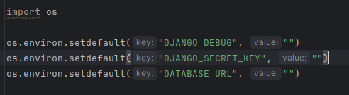

### [How this project was deployed to Heroku](#planning)

- head over to [Heroku Dashboard](https://dashboard.heroku.com/apps)
- create a new app and add all the environment variables to your config vars
- make sure to add DISABLE_COLLECTSTATIC with the value of 1
- if this variable is not used, Heroku will spit out an error
- change DJANGO_DEBUG with the value of False
- make sure that there is a runtime.txt file
- this will tell Heroku what version of python to use
- make sure that requirements.txt is up to date
- make sure to see if Heroku hasn't automatically added a build pack for PostgresSQL
- if it has deleted it as this project is using elephantSQL instead
- connect GitHub and the repo to Heroku and build the project

### [Technology Used](#planning)

- HTML/CSS - html templating and css styling
- Python—logic used in this project
- JavaScript—Used for Models and other front end logic
- Django - Python Framework for developing this project
- PostgresSQL - using elephantSQL for database
- Heroku - cloud deployment
- GitHub - version control
- Pycharm - IDE for development

---

## [Features](#table-of-content)

### [Features that have been included in this project](#features)

When screen gets minimised all content gets reduced to hamburger menu

Authentication was implemented

When the user is not logged in, this image will be displayed

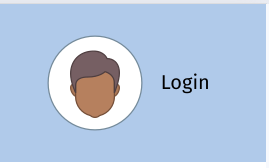

When the user is logged in, a welcome message will be displayed with a different image

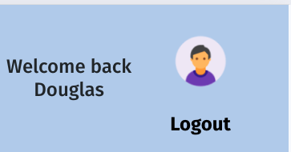

### [Future features to be added at a later stage](#features)

- I would like to add a dashboard for the admin logged-in user
- I have already included a role in the database for this feature

---

## [Testing](#table-of-content)

This is generally the cycle that I tried to follow for testing

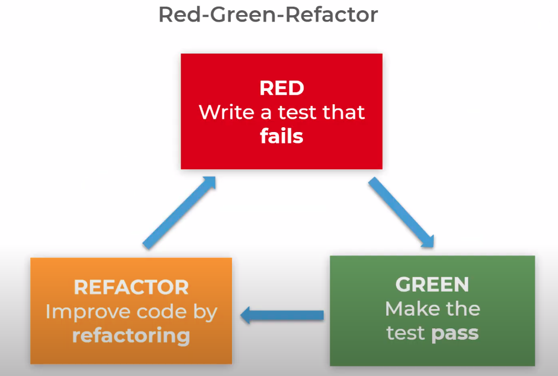

### [Manual Testing](#testing)

#### Header

I have tested the responsive design of the header
There is a collapsable hamburger menu on devices smaller than laptop

This is what it looks like on a laptop and larger

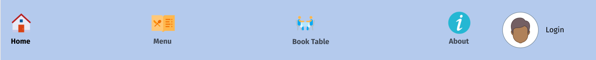

When the navbar becomes smaller than laptop, this is what it will look like

When the hamburger icon menu is open

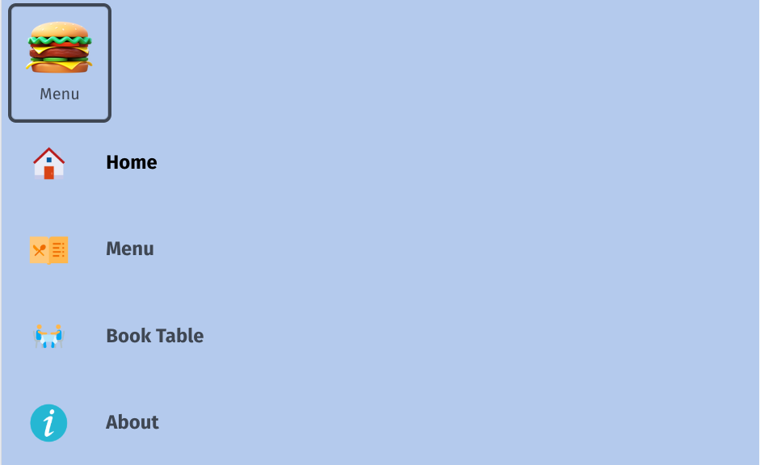

Testing with html validator

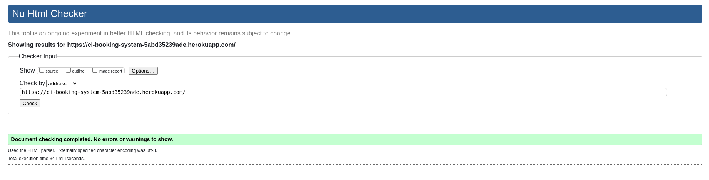

The results can be
found [here](https://validator.w3.org/nu/?doc=https%3A%2F%2Fci-booking-system-5abd35239ade.herokuapp.com%2F)

Testing with a css validator

The results can be
found [here](https://validator.w3.org/nu/?doc=https%3A%2F%2Fci-booking-system-5abd35239ade.herokuapp.com%2F)

This testing was conducted on Lighthouse with Desktop in mind

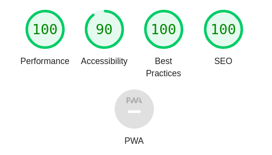

This testing was conducted on Lighthouse with Mobile in mind

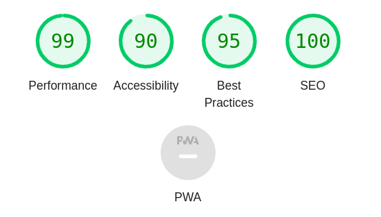

#### Homepage

- When you are added data for the Carousel
- You are only allowed to add three entries per meal
- For instance, you are only allowed three breakfasts, three lunches and three suppers
- The carousel will auto choose which one based on the time of day

If all data is correct, it will show this in the admin panel

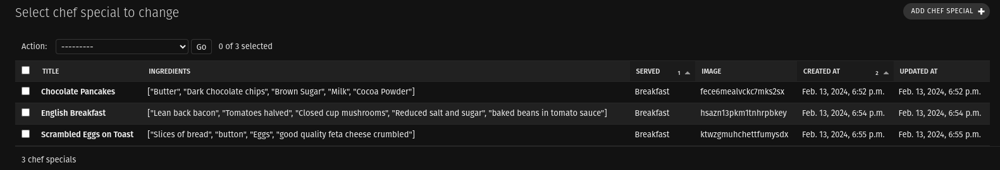

If you are trying to enter more than three entries for breakfast

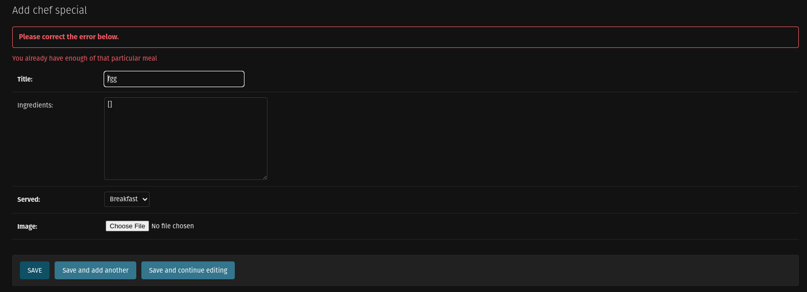

- Was testing to see if I could get the correct meals from the database
- Just by changing the filter variable
- When you enter what type of meal, you want, it is done as a choice based on three numbers
- Zero being breakfast, one being lunched and 2 being supper
- There is also a number three that means that if it doesn't correspond to any number that will then run

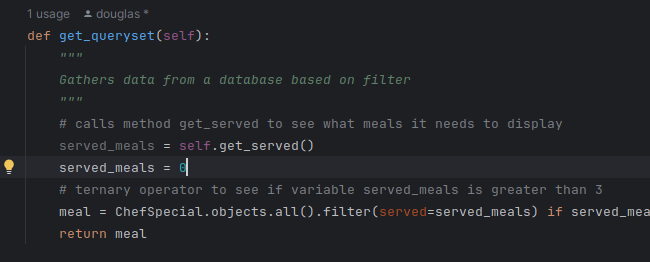

- Tested responsiveness of the carousel
- I don't test for anything below 400pixels

Responsive on Mobile devices

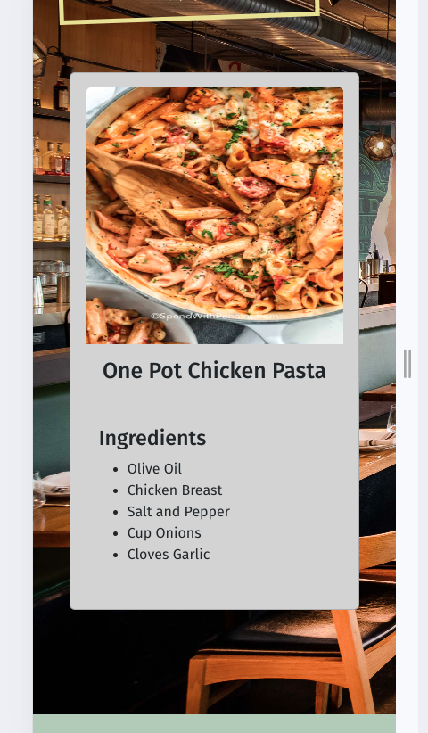

Responsive on Tablet devices

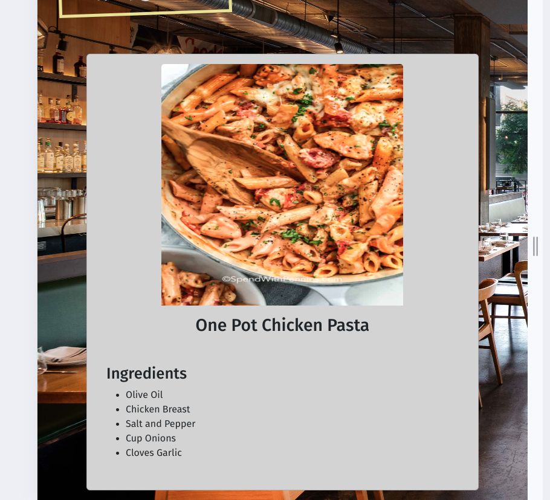

Responsive on Laptop devices

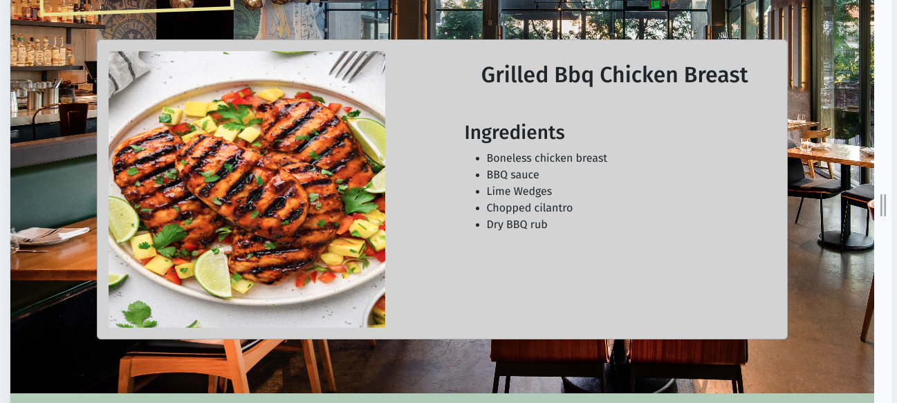

### [Automated Testing](#testing)

The following command can be used to run tests in Parallel
Auto means that it will only run tests on threads that are available
python manage.py test --parallel auto

If you are just wanting to test conventionally

#### Authentication

What was tested in this scenario:

- I wanted to test if a user can be created
- I wanted to test if a user was able to log in

As this is the first time I have written auto tests by myself,
I wanted to keep it basic

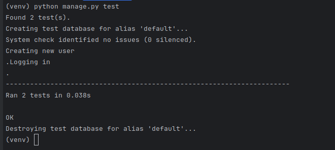

#### Homepage

What was tested in this scenario

- I first created a failing test for breakfast

Changing the assertEqual variable to a number that is not zero

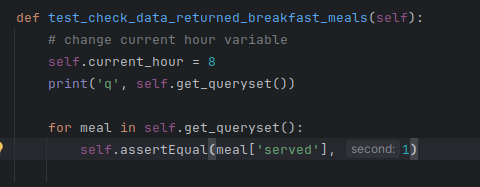

The results of a failing test

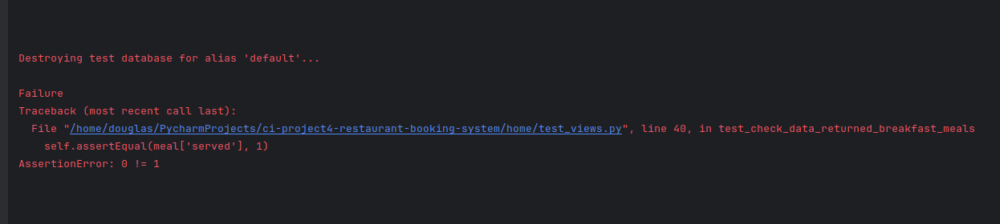

Testing for a passing test

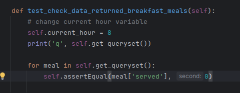

---

## [Bugs](#table-of-content)

### [The text is not aligned correctly to the Authentication Icon](#bugs)

The text was not aligned correctly to the icon above it

- This bug was solved
- by placing it inside a container
- then I could manipulate it with CSS

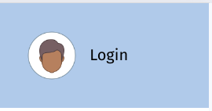

### [Labels are not correctly sitting next to the Icons](#bugs)

The label is sitting to far below the icons
And not aligning correctly

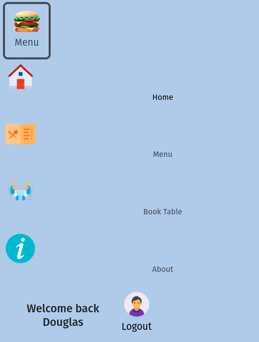

This issue was solved with flexbox and css
They were already in their own container class
I just had to alter the CSS properties

### [Problem with Hamburger Menu](#bugs)

What is the Problem?

- When I am testing responsive design and the Hamburger menu is open
- It doesn't want to display the page icons

How was this Problem solved?

- I separated my code out into a services directory inside the templates directory
- Created two div containers giving each one its own class
- The first had a class of mobile
- The Second had a class of tablet
- I would then hide and un hide the two depending on what size screen it was on
- The reason for breaking up the code is that I needed to call the icons in two different locations
- I am attempting to practice DRY (Don't Repeat Yourself) run coding style

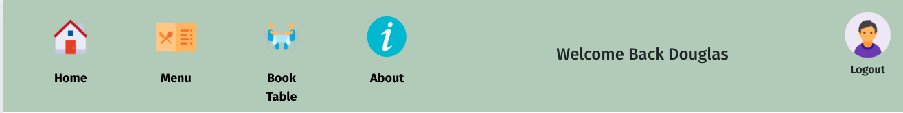

### [Hamburger menu jumps as I try and open and close menu](#bugs)

What is the Issue?

- The hamburger menu is jumping up and down as the menu is opened or closed
- The bug is not visible from the screenshot below

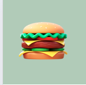

### [Operational error in database as trying to run auto test](#bugs)

Problem?

- When I tied to run python manage.py test
- I get the following error
- error message "django.db.utils.OperationalError: near 'None': syntax error"

Solution?

- Destroy all data in database using the flush command
- I used this command as I suspected that it was an issue in the database
- I then went on to delete all migration files, but accidentally deleted directories at the same time
- Then tried to makemigrations and migrate
- But, for some reason it was not picking up my app like: home, menu, about, book_table models
- so I did a bit of googling to find that I can makemigrations on a single app
- which is what I did: python manage.py makemigrations home
- doing that for all of my apps
- this then created the migrations directory and the initial migration for that app
- after running makemigrations on all my app I then had to migrate my db
- then the page could load properly after that and all was sorted out
- which I could also run python manage.py test
- I was no longer getting that error
- Then test files were now running as they were supposed to
- the issue was all sorted, but now I have to create all my data again
- re-populating my database with data from fixtures json files
- I had to run the command one at a time python manage.py loaddata fixtures/fixture/chef_special.json

Note to myself for a future reference?

- In future don't use the flush command as it will completely wipe my db
- try and delete my migrations directory and start from there

### [Carousel image not being aligned correctly](#bugs)

Problem?

- The image is not being aligned neatly to the carousel on Mobile devices
- This was tested on the iPhone 6/7/8 display

Solution?

- The bug has not been solved yet
- I will try and create an issue for it later

---

## [Credits](#table-of-content)

- How the hamburger menu was achieved was taken from [here](https://www.w3schools.com/howto/howto_js_mobile_navbar.asp)
- All icons in this project were designed
  by [Icons8](https://icons8.com/?utm_source=figma-plugin-icons8&utm_medium=cross-promo&utm_campaign=web-version) with
  the help of Figma
- All images that you see on the homepage for Chef's Specials were taken from homepage, I tried my best to make sure
  that there was no copyright on it
- [Luke Buchanan](https://www.linkedin.com/in/lukebuchanan67/) - Mentor
- [Code Institute](https://codeinstitute.net/) - Bootcamp

---
