## [Introduction](#table-of-content)

This is Part of my Fourth Project at Code Institute.

This is a simple Restaurant Booking System, were I can book tables based on a date and time
I am also able to see the Restaurant's Menu and Chef's specials.

---

# Table of Content

- [Planning](#planning)
    - [Wireframes](#wireframes)
    - [Ux-design](#ux-design)
    - [Colour Pallet](#colour-pallet)
    - [User Stories using MOSCOW Prioritization techniques](#user-stories-using-moscow-prioritization-techniques)
    - [How to start this project locally](#how-to-start-this-project-locally)
    - [How this project was deployed to Heroku](#how-this-project-was-deployed-to-heroku)
    - [Technology Used](#technology-used)
- [Features](#features)
    - [Features that have been included in this project](#features-that-have-been-included-in-this-project)
        - [hamburger image on smaller devices](#hamburger-image-on-smaller-devices)
        - [Authentication](#authentication)
        - [Theme image](#theme-image)
        - [Description of the restaurant](#description-of-the-restaurant)
      - [scrolling left and right arrows for carousel](#scrolling-left-and-right-arrows-for-carousel)
    - [Future features to be added at a later stage](#future-features-to-be-added-at-a-later-stage)
        - [Theme image](#theme-image-1)
- [Testing](#testing)
    - [Manual Testing](#manual-testing)
        - [Testing responsiveness of the image theme](#testing-responsiveness-of-the-image-theme)
        - [Testing responsiveness of the menu page](#testing-responsiveness-of-the-menu-page)
        - [Testing the responsiveness of the about page](#testing-the-responsiveness-of-the-about-page)
        - [Html validation testing](#html-validation-testing)
        - [Css validation testing](#css-validation-testing)
        - [Wave testing for accessibility](#wave-testing-for-accessibility)
        - [lighthouse testing](#lighthouse-testing)
    - [Automated Testing](#automated-testing)
        - [Authentication](#authentication-1)
        - [Homepage](#homepage-2)
        - [Test if theme file exists](#test-if-theme-file-exists)
        - [Test if the correct theme is being displayed](#test-if-the-correct-theme-is-being-displayed)
        - [Test if correct menu gets returned based on slug](#test-if-correct-menu-gets-returned-based-on-slug)
        - [Test if the correct menu is being returned with slug](#test-if-correct-menu-gets-returned-based-on-slug)
- [Bugs](#bugs)
    - [The text is not aligned correctly to the Authentication Icon](#the-text-is-not-aligned-correctly-to-the-authentication-icon)
    - [Labels are not correctly sitting next to the Icons](#labels-are-not-correctly-sitting-next-to-the-icons)
    - [Problem with Hamburger Menu](#problem-with-hamburger-menu)
    - [Hamburger menu jumps as I try and open and close menu](#hamburger-menu-jumps-as-i-try-and-open-and-close-menu)
    - [Operational error in database as trying to run auto test](#operational-error-in-database-as-trying-to-run-auto-test)
    - [Carousel image not being aligned correctly](#carousel-image-not-being-aligned-correctly)
    - [Favicon icon not displaying](#favicon-icon-not-displaying)
    - [Heroku auto refreshing unnecessarily](#heroku-auto-refreshing-unnecessarily)
    - [Navbar not at top of screen](#navbar-not-at-top-of-screen)
    - [Performance issues in page loading](#performance-issues-in-page-loading)
    - [Too many connections to database at once](#too-many-connections-to-database-at-once)
  - [styling of homepage](#styling-of-homepage)
- [Credits](#credits)

---

## [Planning](#table-of-content)

These Wireframes and UX Designs were designed on Figma

### [Wireframes](#planning)

#### Homepage

#### Menu Page

#### About Page

#### Book a table Page

### [Ux-design](#planning)

#### Home Page

#### Menu Page

#### Book Table Page

#### About Page

### ERD diagram

### [Colour Pallet](#planning)

Click [here](https://coolors.co/9f7e69-d2bba0-f2efc7-f7ffe0-ffeee2) to see where I got this color pallet from

How I came by this color Pallet:

I went onto Google and googled: What would be a nice color theme for an exclusive restaurant

- See
  results [here](https://www.google.com/search?client=firefox-b-d&q=what+would+be+a+nice+color+theme+for+an+exclusive+restaurant&dlnr=1&sei=bazIZcmsAvKxhbIP18mBkAE)
- I had thought that a nice light gray would've worked well as some of the colors used with my UX design was already a
  grayish color

### [User Stories using MOSCOW Prioritization techniques](#planning)

This Project was done in incremental stages, trying my best to follow the agile methods.

Header

Kambam board

Explanation of the columns on the board:

- Backlog: this is where the issues start from when they are created
- Ready: these issues are ready to be picked up so work can be conducted
- In Progress: This is what is busy being worked on
- In review: This is the stage were the testing gets done
- Done: for all completed issues

Milestones

This project was done in incremental stages, building it page by page.
As such, the milestone percentage will change slightly in each iteration.

This is when I am 46% done, but only the header issue was added

Footer

- The footer had only three issues in it, so I only labeled them as Must-have
- There was also an issue that I created for Documentation

- Once the footer had been completed, 84% was done.

Homepage

- There were only four issues added for this section
- As I didn't plan on doing a lot of work here

- The milestone was taken after the homepage was done
- When the Menu Page and About Page were added as issues

Menu Page

- I created 10 sticky notes to decide on what I wanted for the issues
- Once I knew what I wanted, then created the issues for the Kambam board,
- Sorting them out into Moscow priorities sticking with 60% Must-have
- I have also created an issue for the documentation
- Which I will do after all required issues are done

Sticky notes on Figma to plan what sort of issues I am wanting to solve

Once the Issues were created, I gave them their labels using MOSCOW priorities

After all, planning is in place the milestone section shows percentage done

About Page

- Screenshot of the issues board using moscow priorities

- The kambam board in action

- When the last section was added, this is the milestone thus far

### [How to start this project locally](#planning)

- when using ssh
- git clone git@github.com:douglas86/ci-project4-restaurant-booking-system.git
- when using http
- git clone https://github.com/douglas86/ci-project4-restaurant-booking-system.git
- make sure to have a look at the runtime.txt file to see what version of python I am using
- then create a virtual environment with that python version
- to see if a virtual environment has been created, the words venv in brackets will appear in the terminal
- as I am using pycharm, the virtual environment will start automatically when I start my IDE
- then install all the packages needed for this project using the following command
- pip install -r requirements.txt
- to start the Django server, run the following command
- create an env.py file this is used to store all environment variables
- create the variable needs for this project see the image below
- placing the name of the variables in the empty quotation marks
- make sure to set DJANGO_DEBUG = True
- django secret keys should never be committed to GitHub
- so if you need one, follow the following link
- [generate a new secret key](https://www.makeuseof.com/django-secret-key-generate-new/#:~:text=You%20can%20accidentally%20make%20your,are%20still%20learning%20about%20GitHub.)
- Then go to [elephantSQL](https://www.elephantsql.com/)
- And create a new database instance to make sure that the version of PostgresSQL is greater than 12
- Once created, then copy and paste the url in the env.py for the DATABASE_URL string
- once that is done, then you can run the command below to run the server
- python manage.py runserver
- you can use ctrl + click on the server name that should open up a web browser at the correct port

env.py

### [How this project was deployed to Heroku](#planning)

- head over to [Heroku Dashboard](https://dashboard.heroku.com/apps)
- create a new app and add all the environment variables to your config vars
- make sure to add DISABLE_COLLECTSTATIC with the value of 1
- if this variable is not used, Heroku will spit out an error
- change DJANGO_DEBUG with the value of False
- make sure that there is a runtime.txt file
- this will tell Heroku what version of python to use
- make sure that requirements.txt is up to date
- make sure to see if Heroku hasn't automatically added a build pack for PostgresSQL
- if it has deleted it as this project is using elephantSQL instead
- connect GitHub and the repo to Heroku and build the project

### [Technology Used](#planning)

- HTML/CSS - html templating and css styling
- Python—logic used in this project
- JavaScript—Used for Models and other front end logic
- Django - Python Framework for developing this project
- PostgresSQL - using elephantSQL for database
- Heroku - cloud deployment
- GitHub - version control
- Pycharm - IDE for development

---

## [Features](#table-of-content)

### [Features that have been included in this project](#features)

#### [hamburger image on smaller devices](#features)

When screen gets minimised all content gets reduced to hamburger menu

#### [Authentication](#features)

When the user is not logged in, this image will be displayed

When the user is logged in, a welcome message will be displayed with a different image

#### [Theme image](#features)

- These themes are small images of the top right of the menu
- This image represents the theme of the year
- It will automatically change based on the time of the year
- it works based on Summer, Winter, Autumn and Spring
- These images are hard coded for now
- But, as a future feature it will be in the database
- This theme image only gets displayed on tablets and bigger devices

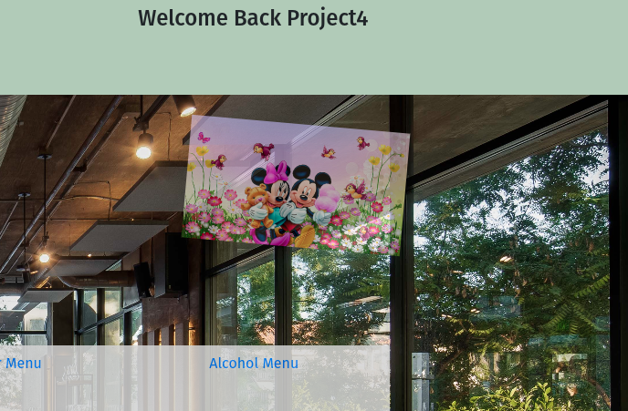

#### [Description of the restaurant](#features)

- Created a description about the restaurant
- With its very beginnings

#### [scrolling left and right arrows for carousel](#features)

- There is an arrow that you can use to scroll left and right
- I have tried to blend it in to the rest of the site

### [Future features to be added at a later stage](#features)

- I would like to add a dashboard for the admin logged-in user
- I have already included a role in the database for this feature
- Search based on Foreign Key in an admin panel:
    - I would like to search based on a foreign key in the admin panel
    - for some reason, I can't seem to search using the search_filed as it does not work on foreign keys

#### [Theme image](#features)

- As a future task as far as theming goes
- I would like to create a model for storing all themes
- Instead of, an image in the background creates some sort of animated background for themes
- I can also do it were I create themes for easter or Christmas and others as needed

---

## [Testing](#table-of-content)

This is generally the cycle that I tried to follow for testing

### [Manual Testing](#testing)

#### Header

I have tested the responsive design of the header
There is a collapsable hamburger menu on devices smaller than laptop

This is what it looks like on a laptop and larger

When the navbar becomes smaller than laptop, this is what it will look like

When the hamburger icon menu is open

Testing with html validator

The results can be
found [here](https://validator.w3.org/nu/?doc=https%3A%2F%2Fci-booking-system-5abd35239ade.herokuapp.com%2F)

Testing with a css validator

The results can be
found [here](https://validator.w3.org/nu/?doc=https%3A%2F%2Fci-booking-system-5abd35239ade.herokuapp.com%2F)

This testing was conducted on Lighthouse with Desktop in mind

This testing was conducted on Lighthouse with Mobile in mind

#### Homepage

- When you are added data for the Carousel
- You are only allowed to add three entries per meal
- For instance, you are only allowed three breakfasts, three lunches and three suppers
- The carousel will auto choose which one based on the time of day

If all data is correct, it will show this in the admin panel

If you are trying to enter more than three entries for breakfast

- Was testing to see if I could get the correct meals from the database
- Just by changing the filter variable
- When you enter what type of meal you want, it is done as a choice based on three numbers
- Zero being breakfast, one being lunched and 2 being supper
- There is also a number three that means that if it doesn't correspond to any number that will then run

- Tested responsiveness of the carousel
- I don't test for anything below 400pixels

Responsive on Mobile devices

Responsive on Tablet devices

Responsive on Laptop devices

#### [Testing responsiveness of the image theme](#manual-testing)

- The theme is responsive across all devices
- If you are on a mobile device, you won't see the theme
- It will only be displayed when on a tablet or bigger

When on a laptop or bigger screen size

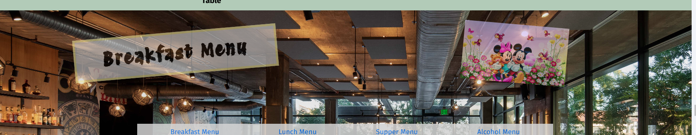

When on tablet devices

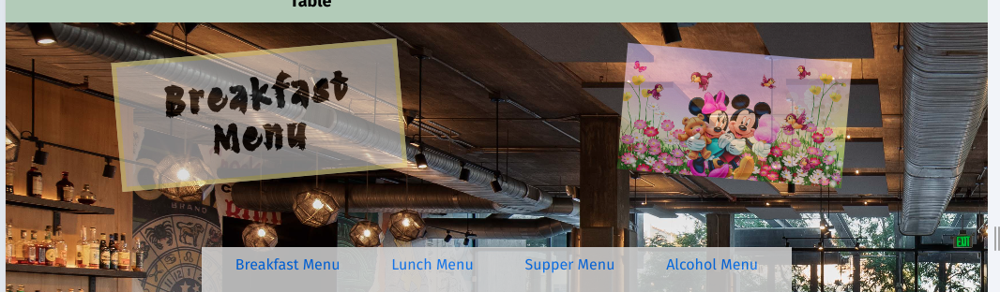

When on mobile devices

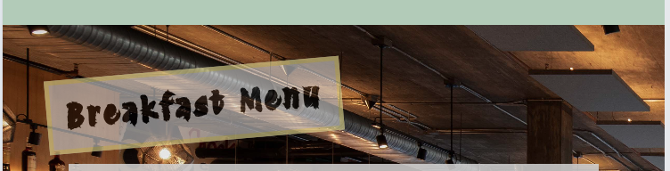

#### [Testing responsiveness of the menu page](#manual-testing)

- Testing to see how responsive the menu page is
- on different screen sizes

Responsive design on laptop

Responsive design on tablet

Responsive design on mobile

#### [Testing the responsiveness of the about page](#manual-testing)

- This testing section was to test to see how the about page
- is going to look at different screen sizes

Responsive design on mobile

Responsive design on Tablet

Responsive design on Laptop

#### [Html validation testing](#manual-testing)

- I tested this on Html Validator
- Using the Heroku link of my live site
- As the validator won't work when copying and pasting code
- This link was tested on the about page

#### [Css validation testing](#manual-testing)

- The only errors that css picked up were with bootstrap
- There were no other errors with my css code

#### [Wave testing for accessibility](#manual-testing)

- With the wave validator, there were just two contrast issues
- With the footer this will be sorted out when I sort out the bug on the footer

#### [lighthouse testing](#manual-testing)

- this lighthouse testing was done in incognito mode
- As some of my extensions were messing with the results

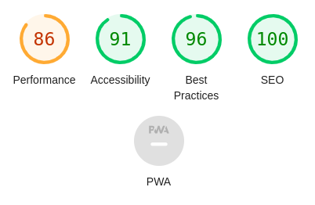

### [Automated Testing](#testing)

The following command can be used to run tests in Parallel
Auto means that it will only run tests on threads that are available
python manage.py test --parallel auto

If you are just wanting to test conventionally

#### [Authentication](#automated-testing)

What was tested in this scenario:

- I wanted to test if a user can be created
- I wanted to test if a user was able to log in

As this is the first time I have written auto tests by myself,
I wanted to keep it basic

#### [Homepage](#automated-testing)

What was tested in this scenario

- I first created a failing test for breakfast

Changing the assertEqual variable to a number that is not zero

The results of a failing test

Testing for a passing test

#### [Test if theme file exists](#automated-testing)

What was being tested?

- I first tested if the file exists
- Passing it the file name of "winterP.jpg"
- Then after that I passed it the correct file name to if the test works
- Passing it the file name of "winter.jpg"

Passing theme on a failing test

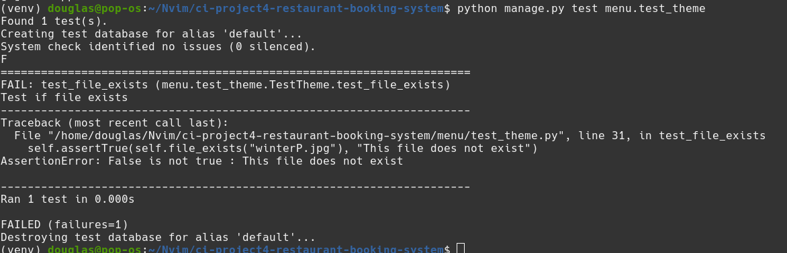

Passing theme on a passing test

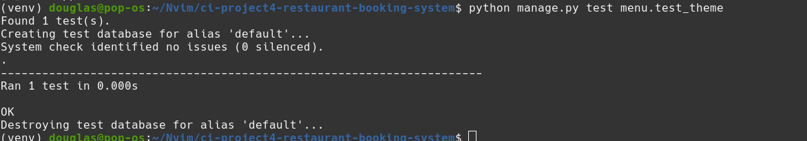

#### [Test if the correct theme is being displayed](#automated-testing)

What was being tested?

- Test if the correct them was returned
- Passing in the month and the filename
- The filename is just hardcoded static images for the theme

Failing test for theme

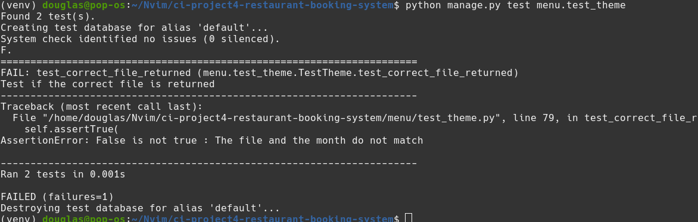

Failing test case

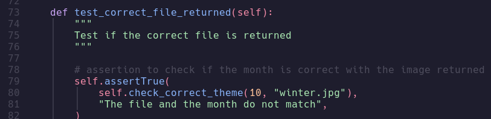

Passing test for theme

Passing test cases

#### [Test if correct menu gets returned based on slug](#automated-testing)

What was tested?

- I purposefully made a spelling error to see if the Supper Menu fails
- Then pass the correct test to see if it passes

Failing test

Passing test

#### [Test if the correct menu is being returned with slug](#automated-testing)

- Test if the correct menu is being returned
- When I pass in the slug
- The slug will be the url of the menu that I want to use

Failing test

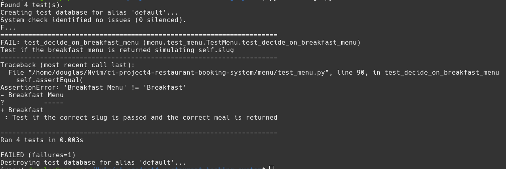

Passing test

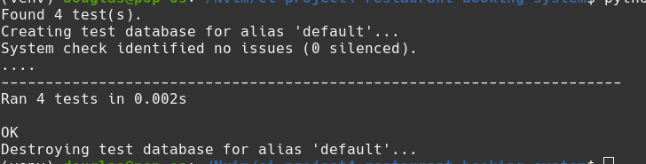

---

## [Bugs](#table-of-content)

### [The text is not aligned correctly to the Authentication Icon](#bugs)

The text was not aligned correctly to the icon above it

- This bug was solved
- by placing it inside a container
- then I could manipulate it with CSS

### [Labels are not correctly sitting next to the Icons](#bugs)

The label is sitting to far below the icons
And not aligning correctly

This issue was solved with flexbox and css
They were already in their own container class
I just had to alter the CSS properties

### [Problem with Hamburger Menu](#bugs)

What is the Problem?

- When I am testing responsive design and the Hamburger menu is open
- It doesn't want to display the page icons

How was this Problem solved?

- I separated my code out into a services directory inside the templates directory
- Created two div containers giving each one its own class
- The first had a class of mobile
- The Second had a class of tablet
- I would then hide and un hide the two depending on what size screen it was on
- The reason for breaking up the code is that I needed to call the icons in two different locations
- I am attempting to practice DRY (Don't Repeat Yourself) run coding style

### [Hamburger menu jumps as I try and open and close menu](#bugs)

What is the Issue?

- The hamburger menu is jumping up and down as the menu is opened or closed
- The bug is not visible from the screenshot below

### [Operational error in database as trying to run auto test](#bugs)

Problem?

- When I tied to run python manage.py test
- I get the following error
- error message "django.db.utils.OperationalError: near 'None': syntax error"

Solution?

- Destroy all data in database using the flush command
- I used this command as I suspected that it was an issue in the database
- I then went on to delete all migration files, but accidentally deleted directories at the same time
- Then tried to makemigrations and migrate
- But, for some reason it was not picking up my app like: home, menu, about, book_table models
- so I did a bit of googling to find that I can makemigrations on a single app
- which is what I did: python manage.py makemigrations home
- doing that for all of my apps
- this then created the migrations directory and the initial migration for that app
- after running makemigrations on all my apps, I then had to migrate my db
- then the page could load properly after that and all was sorted out
- which I could also run python manage.py test
- I was no longer getting that error
- Then test files were now running as they were supposed to
- the issue was all sorted, but now I have to create all my data again
- re-populating my database with data from fixtures json files
- I had to run the command one at a time python manage.py loaddata fixtures/fixture/chef_special.json

Note to myself for a future reference?

- In future don't use the flush command as it will completely wipe my db
- try and delete my migrations directory and start from there

### [Carousel image not being aligned correctly](#bugs)

Problem?

- The image is not being aligned neatly to the carousel on Mobile devices
- This was tested on the iPhone 6/7/8 display

Solution?

- The bug has not been solved yet
- I will try and create an issue for it later

### [Favicon icon not displaying](#bugs)

Problem?

- Favicon icon does not want to load on server start

favicon is not loaded in the browser tab

favicon is not loaded in the console

Solution?

- As soon as I turned some methods in the class Menu
- To functions, as they were static methods
- The icon loaded correctly as intended
- Not quiet sure why or how it worked

### [Heroku auto refreshing unnecessarily](#bugs)

Problem?

- for some reason, heroku is auto refreshing
- I expected that it is a problem with django_browser_reload package
- This package I use for in development
- It refreshes my server on file change

Refreshes browser tab unnecessarily

Refreshing in the Heroku console logs

Solution?

- I solved this problem by adding a simple logic to settings.py and urls.py
- If Debug == 'True' then add django_browser_reload to constant lists
- It needed to be a string for the Debug constant for when environment variables load
- It loads it as a string

Added logic to settings.py file

Added logic to urls.py file

### [Navbar not at top of screen](#bugs)

Problem?

- The navbar is not quite sitting at the top of the screen

Solution?

- The bug has not been solved yet
- I will try and create an issue for it later

### [Performance issues in page loading](#bugs)

Problem?

- The score that I received is too low for lighthouse testing
- I need to bring that score up
- I think that there is too much logic that is happening in the background
- I might have to consider a pip package for multi threading

Solution?

- I have solved this bug by digging into multi-thread processing
- And reduced some of the logic that I was using

### [Too many connections to database at once](#bugs)

Problem?

- When trying to connect to the database on the menu page, I am getting a connection error
- There are too many models trying to connect at once

Solution?

- This problem has not been solved yet
- Will try and come to it at the end

### [styling of homepage](#bugs)

Problem?

- The styling of the homepage does not look the same as the rest of the site

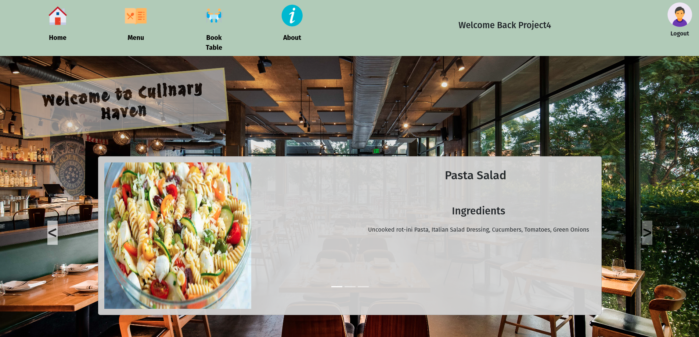

Solution?

- changed all the correct styling for the homepage to make it conform to the rest of the site
- add the correct images to the database
- I have also changed the form for the admin panel that only allows four entries to make room for if you need to update
  one of the models

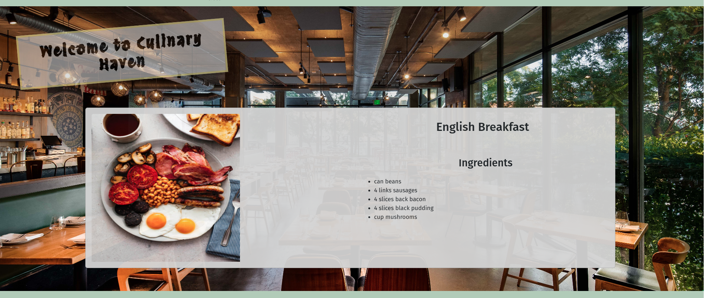

---

## [Credits](#table-of-content)

- How the hamburger menu was achieved was taken from [here](https://www.w3schools.com/howto/howto_js_mobile_navbar.asp)
- All icons in this project were designed
  by [Icons8](https://icons8.com/?utm_source=figma-plugin-icons8&utm_medium=cross-promo&utm_campaign=web-version) with
  the help of Figma
- All images that you see on the homepage for Chef's Specials were taken from homepage, I tried my best to make sure
  that there was no copyright on it
- [Document that assisted me with CRUD operation using Class-Based Views](https://docs.djangoproject.com/en/5.0/topics/class-based-views/generic-editing/)
- [Document that help me with form validation and success url](https://stackoverflow.com/questions/54129416/django-how-do-i-perform-a-createview-redirect-properly)
- [Setting form validation with widgets](https://medium.com/@alex.kirkup/making-error-messages-visible-in-django-forms-1abea48c802a)
- [How to display messages in the template](https://stackoverflow.com/questions/25470452/django-clear-form-field-after-a-submit)
- [example on how to test if file exists](https://www.w3resource.com/python-exercises/unittest/python-unittest-exercise-5.php#:~:text=We%20use%20the%20self.,We%20use%20the%20self.)
- [convert to base64 string](https://dev.to/nemecek_f/django-how-to-send-image-file-as-part-of-response-j05) this was
  used for themes, but decided to take themes out, I am planning on this for a future feature
- [Luke Buchanan](https://www.linkedin.com/in/lukebuchanan67/) - Mentor
- [Code Institute](https://codeinstitute.net/) - Bootcamp

---
