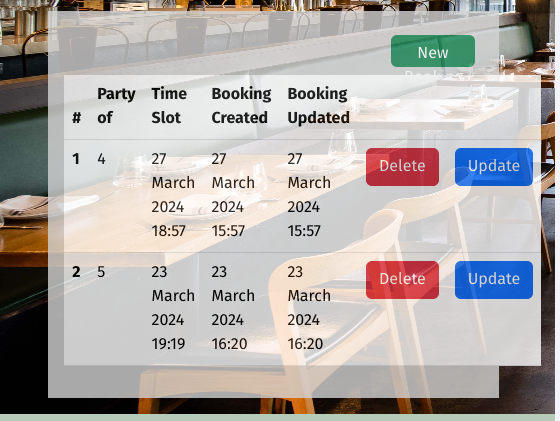
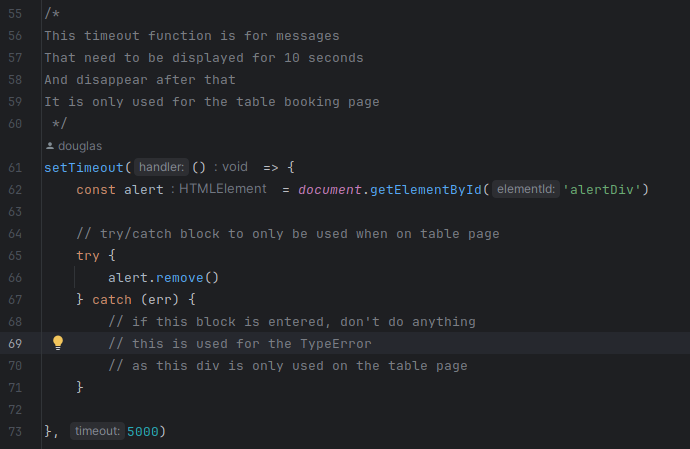

## [Introduction](#table-of-content)

This is Part of my Fourth Project at Code Institute.

This is a simple Restaurant Booking System, were I can book tables based on a date and time
I am also able to see the Restaurant's Menu and Chef's specials.

[Live link can be found here](https://ci-booking-system-5abd35239ade.herokuapp.com/)

---

# Table of Content

- [Planning](#planning)
    - [Wireframes](#wireframes)
    - [Ux-design](#ux-design)
    - [Colour Pallet](#colour-pallet)
    - [User Stories using MOSCOW Prioritization techniques](#user-stories-using-moscow-prioritization-techniques)
    - [How to start this project locally](#how-to-start-this-project-locally)
    - [How this project was deployed to Heroku](#how-this-project-was-deployed-to-heroku)
    - [Technology Used](#technology-used)
    - [neat and clean code](#neat-and-clean-code)
- [Features](#features)
    - [Features that have been included in this project](#features-that-have-been-included-in-this-project)
        - [hamburger image on smaller devices](#hamburger-image-on-smaller-devices)
        - [Authentication](#authentication)
        - [Description of the restaurant](#description-of-the-restaurant)
        - [scrolling left and right arrows for carousel](#scrolling-left-and-right-arrows-for-carousel)
        - [table booking with booking history and next booking](#table-booking-with-booking-history-and-next-booking)
        - [deleting table records](#deleting-table-records)
    - [Future features to be added at a later stage](#future-features-to-be-added-at-a-later-stage)
- [Testing](#testing)
    - [Manual Testing](#manual-testing)
        - [Testing responsiveness of the menu page](#testing-responsiveness-of-the-menu-page)
        - [Testing the responsiveness of the about page](#testing-the-responsiveness-of-the-about-page)
        - [Testing if I can navigate to table page](#testing-if-i-can-navigate-to-table-page)
        - [Testing of updating records](#testing-of-updating-records)
        - [Testing model form for booking a table](#testing-model-form-for-booking-a-table)
            - [Html validation testing](#html-validation-testing)
            - [Css validation testing](#css-validation-testing)
            - [Wave testing for accessibility](#wave-testing-for-accessibility)
            - [lighthouse testing](#lighthouse-testing)
    - [Automated Testing](#automated-testing)
        - [Authentication](#authentication-1)
        - [Homepage](#homepage-2)
        - [Test if correct menu gets returned based on slug](#test-if-correct-menu-gets-returned-based-on-slug)
        - [Test form invalid on Booking a table page](#test-form-invalid-on-booking-a-table-page)
        - [Test form valid on Booking a table page](#test-form-valid-on-booking-a-table-page)
        - [Test protected pages against anonymous user](#test-protected-pages-against-anonymous-user)
        - [Test protected pages against users that are logged in or not](#test-protected-pages-against-users-that-are-logged-in-or-not)
- [Bugs](#bugs)
    - [The text is not aligned correctly to the Authentication Icon](#the-text-is-not-aligned-correctly-to-the-authentication-icon)
    - [Labels are not correctly sitting next to the Icons](#labels-are-not-correctly-sitting-next-to-the-icons)
    - [Problem with Hamburger Menu](#problem-with-hamburger-menu)
    - [Hamburger menu jumps as I try and open and close menu](#hamburger-menu-jumps-as-i-try-and-open-and-close-menu)
    - [Operational error in database as trying to run auto test](#operational-error-in-database-as-trying-to-run-auto-test)
    - [Carousel image not being aligned correctly](#carousel-image-not-being-aligned-correctly)
    - [Favicon icon not displaying](#favicon-icon-not-displaying)
    - [Heroku auto refreshing unnecessarily](#heroku-auto-refreshing-unnecessarily)
    - [Navbar not at top of screen](#navbar-not-at-top-of-screen)
    - [Performance issues in page loading](#performance-issues-in-page-loading)
    - [Too many connections to database at once](#too-many-connections-to-database-at-once)
    - [styling of homepage](#styling-of-homepage)
    - [carousel arrows](#carousel-arrows)
    - [copyright text not showing in footer](#copyright-text-not-showing-in-footer)
    - [copyright text overlapping with developer content](#copyright-text-overlapping-with-developer-content)
    - [next booking not being displayed](#next-booking-not-being-displayed)
    - [not recognizing daylight savings mode](#not-recognizing-daylight-savings-mode)
    - [table over lapping on smaller devices](#table-over-lapping-on-smaller-devices)
    - [TypeError in console](#typeerror-in-console)
    - [Am I Responsive does not display image](#am-i-responsive-does-not-display-image)
- [Credits](#credits)

---

## [Planning](#table-of-content)

These Wireframes and UX Designs were designed on Figma

### [Wireframes](#planning)

#### Homepage

- The message box in the middle is for where the carousel will go

#### Menu Page

- The box in the middle is to represent the menu
- breakfast, lunch, supper, alcohol or starter menu

#### About Page

- The box in the middle is where I will place a section about our humble beginnings

#### Book a table Page

- The big box in the middle is for all booking history
- The top box on the left-hand side is for the last booking
- The one under that is for vouchers
- The voucher system has been taken out of the equation for now

### [Ux-design](#planning)

#### Home Page

#### Menu Page

#### Book Table Page

#### About Page

### ERD diagram

- I have taken the voucher model out
- as of now it became an unnecessary feature

### [Colour Pallet](#planning)

Click [here](https://coolors.co/9f7e69-d2bba0-f2efc7-f7ffe0-ffeee2) to see where I got this color pallet from

How I came by this color Pallet:

I went onto Google and googled: What would be a nice color theme for an exclusive restaurant

- See
  results [here](https://www.google.com/search?client=firefox-b-d&q=what+would+be+a+nice+color+theme+for+an+exclusive+restaurant&dlnr=1&sei=bazIZcmsAvKxhbIP18mBkAE)
- I had thought that a nice light gray would've worked well as some of the colors used with my UX design was already a
  grayish color

### [User Stories using MOSCOW Prioritization techniques](#planning)

This Project was done in incremental stages, trying my best to follow the agile methods.

Header

kanban board

Explanation of the columns on the board:

- Backlog: this is where the issues start from when they are created
- Ready: these issues are ready to be picked up so work can be conducted
- In Progress: This is what is busy being worked on
- In review: This is the stage were the testing gets done
- Done: for all completed issues

Milestones

This project was done in incremental stages, building it page by page.
As such, the milestone percentage will change slightly in each iteration.

This is when I am 46% done, but only the header issue was added

Footer

- The footer had only three issues in it, so I only labeled them as Must-have
- There was also an issue that I created for Documentation

- Once the footer had been completed, 84% was done.

Homepage

- There were only four issues added for this section
- As I didn't plan on doing a lot of work here

- The milestone was taken after the homepage was done
- When the Menu Page and About Page were added as issues

Menu Page

- I created 10 sticky notes to decide on what I wanted for the issues
- Once I knew what I wanted, then created the issues for the kanban board,
- Sorting them out into Moscow priorities sticking with 60% Must-have
- I have also created an issue for the documentation
- Which I will do after all required issues are done

Sticky notes on Figma to plan what sort of issues I am wanting to solve

Once the Issues were created, I gave them their labels using MOSCOW priorities

After all, planning is in place the milestone section shows percentage done

About Page

- Screenshot of the issues board using moscow priorities

- The kanban board in action

- When the last section was added, this is the milestone thus far

Table booking Page

- Screenshot of the kanban board when busy on the bookings page

- Screenshot of the Milestone project board

### [How to start this project locally](#planning)

- when using ssh
- git clone git@github.com: douglas86/ci-project4-restaurant-booking-system.git
- when using http
- git clone https://github.com/douglas86/ci-project4-restaurant-booking-system.git
- make sure to have a look at the runtime.txt file to see what version of python I am using
- then create a virtual environment with that python version
- to see if a virtual environment has been created, the words venv in brackets will appear in the terminal
- as I am using pycharm, the virtual environment will start automatically when I start my IDE
- then install all the packages needed for this project using the following command
- pip install -r requirements.txt
- to start the Django server, run the following command
- create an env.py file this is used to store all environment variables
- create the variable needs for this project see the image below
- placing the name of the variables in the empty quotation marks
- make sure to set DJANGO_DEBUG = True
- django secret keys should never be committed to GitHub
- so if you need one, follow the following link
- [generate a new secret key](https://www.makeuseof.com/django-secret-key-generate-new/#:~:text=You%20can%20accidentally%20make%20your,are%20still%20learning%20about%20GitHub.)
- Then go to [elephantSQL](https://www.elephantsql.com/)
- And create a new database instance to make sure that the version of PostgresSQL is greater than 12
- Once created, then copy and paste the url in the env.py for the DATABASE_URL string
- once that is done, then you can run the command below to run the server
- python manage.py runserver
- you can use ctrl + click on the server name that should open up a web browser at the correct port

env.py

### [How this project was deployed to Heroku](#planning)

- head over to [Heroku Dashboard](https://dashboard.heroku.com/apps)
- create a new app and add all the environment variables to your config vars
- make sure to add DISABLE_COLLECT STATIC with the value of 1
- if this variable is not used, Heroku will spit out an error
- change DJANGO_DEBUG with the value of False
- make sure that there is a runtime.txt file
- this will tell Heroku what version of python to use
- make sure that requirements.txt is updated
- make sure to see if Heroku hasn't automatically added a build pack for PostgresSQL
- if it has deleted it as this project is using elephantSQL instead
- connect GitHub and the repo to Heroku and build the project

### [Technology Used](#planning)

- HTML/CSS - HTML templating and CSS styling
- Python—logic used in this project
- JavaScript—Used for Models and other front end logic
- Django - Python Framework for developing this project
- PostgresSQL - using elephantSQL for database
- Heroku - cloud deployment
- GitHub - version control
- Pycharm - IDE for development

### [neat and clean code](#planning)

- Code always needs to be kept neat and tidy
- As such, I have tried my best to organize my code readably

order of imports

- standard libraries
- third-party libraries
- django imports
- local imports
- imported based on logic: like try/except or if statements

[reference](https://docs.djangoproject.com/en/dev/internals/contributing/writing-code/coding-style/#:~:text=Put%20imports%20in%20these%20groups,import%20objects%20in%20each%20section.)

order of methods in classes

- magic methods: def __magic_method__(self)
- public methods: def public_method(self)
- class method: class within class
- private methods: def private_methods(self): helper functions
- get_queryset: this is used for gathering data for get_context_data
- get_context_data: this is for rendering data to a template file

order of classes within files:

- follow CRUD operations for views
- follow alphabetical order for all other files

order in test files:

- setUp method
- helper functions: in alphabetical order, then grouped together by relevance
- tests: in alphabetical order

[reference](https://stackoverflow.com/questions/10289461/what-is-a-good-way-to-order-methods-in-a-python-class)

---

## [Features](#table-of-content)

### [Features that have been included in this project](#features)

#### [hamburger image on smaller devices](#features)

When screen gets minimised all content gets reduced to hamburger menu

- This has since been changed to the three horizontal lines
- as it made for better UX design

#### [Authentication](#features)

When the user is not logged in, this image will be displayed

When the user is logged in, a welcome message will be displayed with a different image

#### [Description of the restaurant](#features)

- Created a description about the restaurant
- With its very beginnings

#### [scrolling left and right arrows for carousel](#features)

- There is an arrow that you can use to scroll left and right
- I have tried to blend it in to the rest of the site

- The design layout has changed slightly since this image
- I have added it as a card, giving it better styling

#### [table booking with booking history and next booking](#features)

- You can only book a table if you are logged in
- The icon in the header will not be displayed if you are logged out
- There is a section to show all history of your bookings
- I have left out pagination, as I will be implementing it at a later date
- Displaying all history bookings as a table
- I have also added it to display your next booking
- But at this time it will only display the last booking that you have booked for
- I have not added the logic needed to work out the next booking
- as if you had a few bookings after the current date
- it will just display the last one
- As I believe at this stage, it will be a performance issue, as async has not been worked out properly yet

- What it looks like on mobile devices

- What it looks like on desktop devices

#### [deleting table records](#features)

- Once the Delete button is clicked
- a modal will pop up for deleting the record from the database

#### [reset password based on username](#features)

- when you want to reset your password, enter your username

- If the username is correct, it will take you to a page for a temporary password

- There is a link on that page that takes you to the change password page
- Which you can only access if you log in with the temp password

- As a future feature, I would like to authenticate by email
- As it will be more secure

### [Future features to be added at a later stage](#features)

- I would like to add a dashboard for the admin logged-in user
- I have already included a role in the database for this feature
- Search based on Foreign Key in an admin panel:
    - I would like to search based on a foreign key in the admin panel
    - for some reason, I can't seem to search using the search_filed as it does not work on foreign keys
- I am wanting to implement async/await for fetching data
- As a future feature, I would like to add email for reset password

---

## [Testing](#table-of-content)

- This is generally the cycle that I tried to follow for testing

### [Manual Testing](#testing)

| Title                                   | Pass |
|-----------------------------------------|------|
| Header                                  | Yes  |
| Homepage                                | Yes  |
| Testing responsive of the menu page     | Yes  |
| Testing responsive of the about page    | Yes  |
| Testing of updating records             | Yes  |
| Testing if I can navigate to table page | Yes  |
| Testing model form for booking a table  | Yes  |
| HTML Validation testing                 | Yes  |
| CSS Validation testings                 | Yes  |
| Wave testing for accessibility          | Yes  |
| Lighthouse testing                      | Yes  |

#### Header

I have tested the responsive design of the header
There is a collapsable hamburger menu on devices smaller than laptop

This is what it looks like on a laptop and larger

When the navbar becomes smaller than laptop, this is what it will look like

- The hamburger-menu has changed to the three horizontal lines

When the hamburger icon menu is open

Testing with HTML validator

The results can be
found [here](https://validator.w3.org/nu/?doc=https%3A%2F%2Fci-booking-system-5abd35239ade.herokuapp.com%2F)

Testing with a CSS validator

The results can be
found [here](https://validator.w3.org/nu/?doc=https%3A%2F%2Fci-booking-system-5abd35239ade.herokuapp.com%2F)

This testing was conducted on Lighthouse with Desktop in mind

This testing was conducted on Lighthouse with Mobile in mind

#### Homepage

- When do I have added data for the Carousel?
- You are only allowed to add three entries per meal
- For instance, you are only allowed three breakfasts, three lunches and three suppers
- The carousel will auto choose which one based on the time of day
- I have allowed for four entries, based on the fact that if you need to update one of them

If all data is correct, it will show this in the admin panel

If you are trying to enter more than three entries for breakfast

- Was testing to see if I could get the correct meals from the database
- Just by changing the filter variable
- When you enter what type of meal you want, it is done as a choice based on three numbers
- Zero being breakfast, one being lunched and 2 being supper
- There is also a number three that means that if it doesn't correspond to any number that will then run

- Tested responsiveness of the carousel
- I don't test for anything below 400 pixels

Responsive on Mobile devices

Responsive on Tablet devices

Responsive on Laptop devices

- This design has changed to a card since it was taken

#### [Testing responsiveness of the menu page](#manual-testing)

- Testing to see how responsive the menu page is
- on different screen sizes

Responsive design on laptop

Responsive design on tablet

Responsive design on mobile

- I have changed the background color for the headings

#### [Testing the responsiveness of the about page](#manual-testing)

- This testing section was to test it to see how the about page
- is going to look at different screen sizes

Responsive design on mobile

Responsive design on Tablet

Responsive design on Laptop

#### [Testing of updating records](#manual-testing)

- When the update button is clicked
- The modal will popup using form validation
- I have not yet been able to pre-populate the form using JavaScript
- That will be added as a future feature
- However, the update does work
- You have to update both fields at the sametime
- Clicking the "X" or the Cancel button will exit the modal
- When submit is clicked, it will send it to a database for updating
- which will send you a message to say it has been updated

#### [Testing if I can navigate to table page](#manual-testing)

- when I am logged out and I try to log in to the table page
- it redirects me to sign in page

- manually entering the address in address bar

- when hit enters the address bar

#### [Testing model form for booking a table](#manual-testing)

- The number of seats only allows you to select from 1 to 10
- The validation of the timeslots only allows you to select from 1 hour of present time
- As a logged-in user, you are only allowed to book once a day, to eliminate double booking on the same day
- The modal is also fully responsive
- I have not been able to work out daylight savings mode

Modal form

Modal booking message

Modal testing of incorrect time slot

#### [Html validation testing](#manual-testing)

- I tested this on HTML Validator
- Using the Heroku link of my live site
- As the validator won't work when copying and pasting code
- This link was tested on the about page
- But all the pages are only giving info warnings

#### [Css validation testing](#manual-testing)

- The only errors that CSS picked up were with bootstrap
- There were no other errors with my CSS code

#### [Wave testing for accessibility](#manual-testing)

- With the wave validator, there seems to be just two contrast issues on all pages
- This is a small issue with the contrast of the developer section in footer

#### [lighthouse testing](#manual-testing)

- this lighthouse testing was done in incognito mode
- As some of my extensions were messing with the results

home page on mobile

home page on desktop

menu page on mobile

menu page on desktop

table booking page on mobile

table booking page on desktop

about page on mobile

about page on desktop

### [Automated Testing](#testing)

The following command can be used to run tests in Parallel
Auto means that it will only run tests on threads that are available
python manage.py test --parallel auto

If you are just wanting to test conventionally

| Title                                                        | Pass |
|--------------------------------------------------------------|------|
| Authentication                                               | Yes  |
| Homepage                                                     | Yes  |
| Test if correct menu gets returned based on slug             | Yes  |
| Test form invalid on Booking a table page                    | Yes  |
| Test form valid on Booking a table page                      | Yes  |
| Test protected pages against anonymous user                  | Yes  |
| Test protected pages against users that are logged in or not | Yes  |

#### [Authentication](#automated-testing)

What was tested in this scenario:

- I wanted to test it if a user can be created
- I wanted to test it if a user was able to log in

As this is the first time I have written auto tests by myself,
I wanted to keep it basic

#### [Homepage](#automated-testing)

What was tested in this scenario

- I first created a failing test for breakfast

Changing the assertEqual variable to a number that is not zero

The results of a failing test

Testing for a passing test

#### [Test if correct menu gets returned based on slug](#automated-testing)

What was tested?

- I purposefully made a spelling error to see if the Supper Menu fails
- Then pass the correct test to see if it passes

Failing test

Passing test

#### [Test form invalid on Booking a table page](#automated-testing)

- First testing for a negative test
- changed seats form data to 2
- wanting to see what happens if the correct data is entered
- to make sure that form validation is working correctly
- Then changed form seats data to 20
- wanting to see if it gives me a false reading
- making this test, test for a false value

- Testing form invalid failing test

- Testing form invalid passing test

#### [Test form valid on Booking a table page](#automated-testing)

- Tested for incorrect value changed seats data to 20
- Just to get a negative result
- Tested for correct value changed seats data to 2
- To get a positive test result

- Testing form valid failing test

- Testing form valid passing test

#### [Test protected pages against anonymous user](#automated-testing)

- Test for a failing test, if status code is not 302
- For some reason this test, tests against a 302 http status code
- 302 status codes mean resources permanently removed, in other words, it was there but then were moved somewhere else

- Test anonymous user failing test

- Test anonymous user passing test

#### [Test protected pages against users that are logged in or not](#automated-testing)

- Testing if the status code is something other than 200 if it returns an error message
- Testing if the status code is 200, a passing test

- Test user failing test

- Test user passing test

---

## [Bugs](#table-of-content)

| Title                                                        | Solved |
|--------------------------------------------------------------|--------|
| The text is not aligned correctly to the Authentication Icon | Yes    |
| Labels are not correctly sitting next to the Icons           | Yes    |
| Problem with Hamburger Menu                                  | Yes    |
| Hamburger menu jumps as I try and open and close menu        | No     |
| Operational error in database as trying to run auto test     | Yes    |
| Carousel image not being aligned correctly                   | Yes    |
| Favicon icon not displaying                                  | Yes    |
| Heroku auto refreshing unnecessarily                         | Yes    |
| Navbar not at top of screen                                  | Yes    |   
| Performance issues in page loading                           | Yes    |
| Too many connections to database at once                     | Yes    |
| Styling of homepage                                          | Yes    |
| Carousel arrows                                              | Yes    |
| Copyright test not showing in footer                         | Yes    |
| Copyright text overlapping with developer content            | Yes    |
| Next booking not being displayed                             | Yes    |
| Not recognizing daylight savings mode                        | No     |
| Table over lapping on smaller devices                        | Yes    |
| TypeError in console                                         | Yes    |
| Am I Responsive does not display image                       | No     |

### [The text is not aligned correctly to the Authentication Icon](#bugs)

The text was not aligned correctly to the icon above it

- This bug was solved
- by placing it inside a container
- then I could manipulate it with CSS

### [Labels are not correctly sitting next to the Icons](#bugs)

The label is sitting to far below the icons
And not aligning correctly

This issue was solved with flexbox and CSS
They were already in their own container class
I just had to alter the CSS properties

### [Problem with Hamburger Menu](#bugs)

What is the Problem?

- When I am testing responsive design and the Hamburger menu is open
- It doesn't want to display the page icons

How was this Problem solved?

- I separated my code out into a services directory inside the templates directory
- Created two div containers giving each one its own class
- The first had a class of mobile
- The Second had a class of tablet
- I would then hide and un hide the two depending on what size screen it was on
- The reason for breaking up the code is that I needed to call the icons in two different locations
- I am attempting to practice DRY (Don't Repeat Yourself) run coding style

### [Hamburger menu jumps as I try and open and close menu](#bugs)

What is the Issue?

- The hamburger menu is jumping up and down as the menu is opened or closed
- The bug is not visible from the screenshot below

- I have since changed to the horizontal icon but the bug is still there

### [Operational error in database as trying to run auto test](#bugs)

Problem?

- When I tied to run python manage.py test
- I get the following error
- error message "django.db.utils.OperationalError: near 'None': syntax error"

Solution?

- Destroy all data in database using the flush command
- I used this command as I suspected that it was an issue in the database
- I then went on to delete all migration files, but accidentally deleted directories at the same time
- Then tried to makemigrations and migrate
- But, for some reason it was not picking up my app like: home, menu, about, book_table models
- so I did a bit of googling to find that I can makemigrations on a single app
- which is what I did: python manage.py makemigrations home
- doing that for all of my apps
- this then created the migrations directory and the initial migration for that app
- after running makemigrations on all my apps, I then had to migrate my db
- then the page could load properly after that and all was sorted out
- which I could also run python manage.py test
- I was no longer getting that error
- Then test files were now running as they were supposed to
- the issue was all sorted, but now I have to create all my data again
- re-populating my database with data from fixtures JSON files
- I had to run the command one at a time python manage.py loaddata fixtures/fixture/chef_special.json

Note to myself for a future reference?

- In future don't use the flush command as it will completely wipe my db
- try and delete my migrations directory and start from there

### [Carousel image not being aligned correctly](#bugs)

Problem?

- The image is not being aligned neatly to the carousel on Mobile devices
- This was tested on the iPhone 6/7/8 display

Solution?

- This bug has been solved using cards
- as cards were easier to keep content in a container

### [Favicon icon not displaying](#bugs)

Problem?

- Favicon icon does not want to load on server start

favicon is not loaded in the browser tab

favicon is not loaded in the console

Solution?

- As soon as I turned some methods in the class Menu
- To functions, as they were static methods
- The icon loaded correctly as intended
- Not quiet sure why or how it worked

### [Heroku auto refreshing unnecessarily](#bugs)

Problem?

- for some reason, heroku is auto refreshing
- I expected that it is a problem with django_browser_reload package
- This package I use for in development
- It refreshes my server on file change

Refreshes browser tab unnecessarily

Refreshing in the Heroku console logs

Solution?

- I solved this problem by adding a simple logic to settings.py and urls.py
- If Debug == 'True' then add django_browser_reload to constant lists
- It needed to be a string for the Debug constant for when environment variables load
- It loads it as a string

Added logic to settings.py file

Added logic to urls.py file

### [Navbar not at top of screen](#bugs)

Problem?

- The navbar is not quite sitting at the top of the screen

Solution?

- this bug was solved with simple CSS

### [Performance issues in page loading](#bugs)

Problem?

- The score that I received is too low for lighthouse testing
- I need to bring that score up
- I think that there is too much logic that is happening in the background
- I might have to consider a pip package for multi threading

Solution?

- I have solved this bug by simplify some of my logic that I use

### [Too many connections to database at once](#bugs)

Problem?

- When trying to connect to the database on the menu page, I am getting a connection error
- There are too many models trying to connect at once

Solution?

- with this error, I was using thread module
- with using thread module, you sometimes might get a thread lock issue
- the computer doesn't know what todo, or it sends to many signals to elephantSQL
- whichever issue it was, I have now completely removed thread module
- and made two global variables to gather data that I needed
- then filter it out for when I need it

- These variables have since been moved inside the class

### [styling of homepage](#bugs)

Problem?

- The styling of the homepage does not look the same as the rest of the site

Solution?

- I have now created it as a card within the carousel
- It is responsive from 375 pixels
- the indicators at the bottom will disappear on screen sizes less than 400 px
- the indicator is clickable for if you want to go to a specific item
- with side indicators to click for left or right images

### [carousel arrows](#bugs)

- carousel arrows are being displayed when there is no carousel to display
- on certain devices the arrows don't seem to want to show up properly
- at this stage, I am not sure how to change that

### [copyright text not showing in footer](#bugs)

- The current year is not showing when
- on the logout, login and sign out forms

### [copyright text overlapping with developer content](#bugs)

Problem?

- Overlapping text in footer

Solution?

- changed the left and right margin from 0.5em to 1 em

### [next booking not being displayed](#bugs)

Problem?

- The Next booking is supposed to show the last booking in the history table

Solution?

- There was just a simple variable that I had to add
- I also changed from next booking to last booking
- As last booking made more sense

### [not recognizing daylight savings mode](#bugs)

Problem?

- Django does not recognize daylight savings time
- For some reason, Django does not change time zones
- As I have just reached daylight savings mode

This is the current date and time of my computer

Solution?

- This bug has not been solved yet
- This is also added as an extra feature for future reference

This is what was saved in the database with current model
Notice that the Booking created time is an hour difference

### [table over lapping on smaller devices](#bugs)

Problem?

- The table was not responding when getting to smaller devices

Solution?

- Hide the last child element on smaller devices
- In this case, the Delete and Update buttons

- I have decided that delete and update buttons
- it will only be used for screen sizes bigger than tablet

### [TypeError in console](#bugs)

Problem?

- TypeError occurs after a few seconds of page load
- This error occurs from the timeout section in the script.js file

Solution?

- added a try/catch block for TypeError
- in the catch block nothing will occur
- I didn't see anywhere on the internet were you can't do a try/catch like this

### [Am I Responsive does not display image](#bugs)

Problem?

- Am I Responsive does not want to display a screenshot of my live website

Solution?

- Not sure what this problem is it might be a loading issue

---

## [Credits](#table-of-content)

- How the hamburger menu was achieved was taken from [here](https://www.w3schools.com/howto/howto_js_mobile_navbar.asp)
- All icons in this project were designed
  by [Icons8](https://icons8.com/?utm_source=figma-plugin-icons8&utm_medium=cross-promo&utm_campaign=web-version) with
  the help of Figma
- All images that you see on the homepage for Chef's Specials were taken from homepage, I tried my best to make sure
  that there was no copyright on it
- [Document that assisted me with CRUD operation using Class-Based Views](https://docs.djangoproject.com/en/5.0/topics/class-based-views/generic-editing/)
- [Document that help me with form validation and success url](https://stackoverflow.com/questions/54129416/django-how-do-i-perform-a-createview-redirect-properly)
- [Setting form validation with widgets](https://medium.com/@alex.kirkup/making-error-messages-visible-in-django-forms-1abea48c802a)
- [How to display messages in the template](https://stackoverflow.com/questions/25470452/django-clear-form-field-after-a-submit)
- [example on how to test if file exists](https://www.w3resource.com/python-exercises/unittest/python-unittest-exercise-5.php#:~:text=We%20use%20the%20self.,We%20use%20the%20self.)
- [convert to base64 string](https://dev.to/nemecek_f/django-how-to-send-image-file-as-part-of-response-j05) this was
  used for themes, but decided to take themes out, I am planning on this for a future feature
- [Luke Buchanan](https://www.linkedin.com/in/lukebuchanan67/) - Mentor
- [Code Institute](https://codeinstitute.net/) - Bootcamp
- [reference for the success message](https://stackoverflow.com/questions/36087752/django-messaging-framework-how-to-only-display-success-messages)
- [Example of how to use the Delete View](https://www.geeksforgeeks.org/deleteview-class-based-views-django/)

---
